# 🔫 Ações A-F

### 1. Ammunation 

* Bandidos: Máximo de 2
* Políciais: Máximo de 3
* Armamento: Somentes Pistolas.
* Negociação: Não Há.
* Refém: Não Permitido.

Observações:

* Fugas não são permitidas.

### 2. Antena 

* Bandidos: Min. 4 | Máx: 6
* Políciais: 1 a mais que o número de bandidos
* Armamento: Somente Pistolas
* Negociação Não há. Obrigatoriamente TetiChão.
* Refém: Não Permitido. Observações:
* Fugas não são permitidas.

<figure>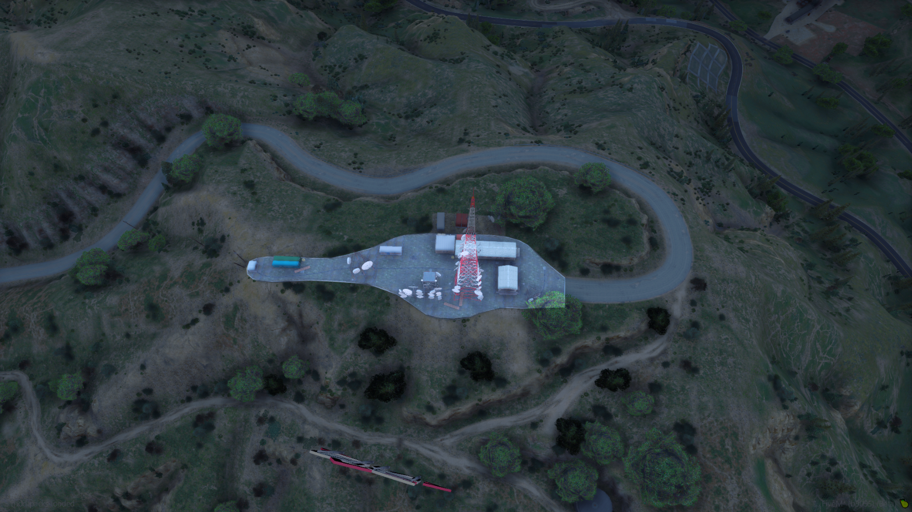<figcaption></figcaption></figure>

### 3. Açougue 

* Bandidos: Min. de 6. | Máx. 8
* Políciais: 3 a mais que o número de bandidos.
* Armamento: Somente Sub-Metralhadoras.
* Smoke: 2.
* Negociação: Não há. Não é permitido permanecer fora mas o rushe está liberado.
* Refém: Não permitido.

Observações:

* Fugas não são permitidas.
*

    <figure>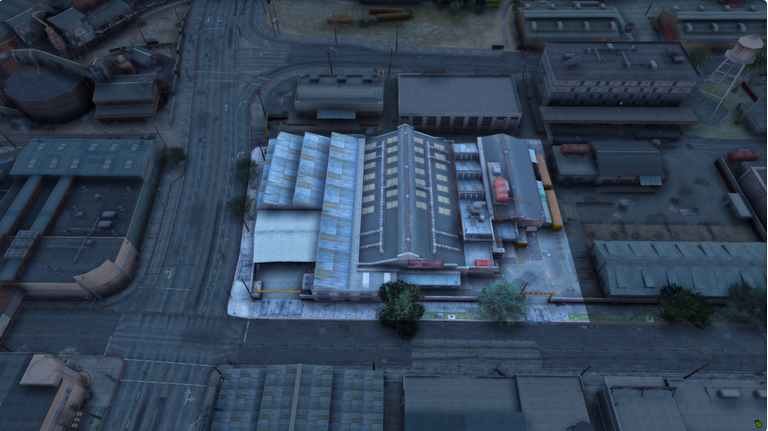<figcaption></figcaption></figure>

### 4. Banco Central 

* Bandidos: Mín. de 8. | Máx. 10
* Políciais: 4 a mais que o número de bandidos.
* Armamento: Somente Fuzil.
* Smoke: 4.
* Negociação: Obrigatória
* Refém: Mín. de 2 | Máx. 5

Observações:

* Não é permitido ter bandidos fora durante a fuga.
* Não é permitido usar interior do cofre.
* Não é permitido utilizar a mesa pra subir na estante;
* Não é permitido utilizar a mesa como cobertura para troca de tiros.

<figure>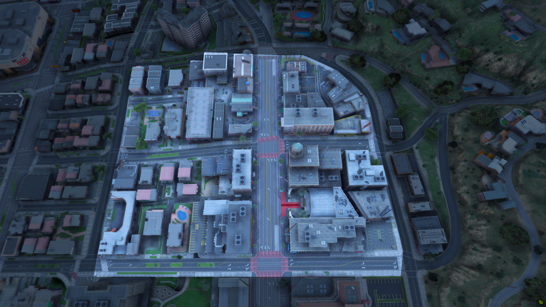<figcaption></figcaption></figure>

### 4. Barbearia 

* Bandidos: Mín. de 2. | Máx. 3
* Políciais: Máximo de 4.
* Armamento: Somente Arma Branca.
* Negociação: Não há.
* Refém: Não permitido.

Observações:

* Fugas são proibidas.
* Os assaltantes começam de dentro pra fora, e os policiais se encontram do outro lado da rua, indo de fora pra dentro.

### 5. BobCat 

* Bandidos: Obrigatório 6.
* Políciais: Máximo de 8.
* Armamento: Somente Submetralhadora
* Negociação: Não há.
* Refém: Não permitido.

Observações:

* Bandidos não podem rushar pra fora.

<figure>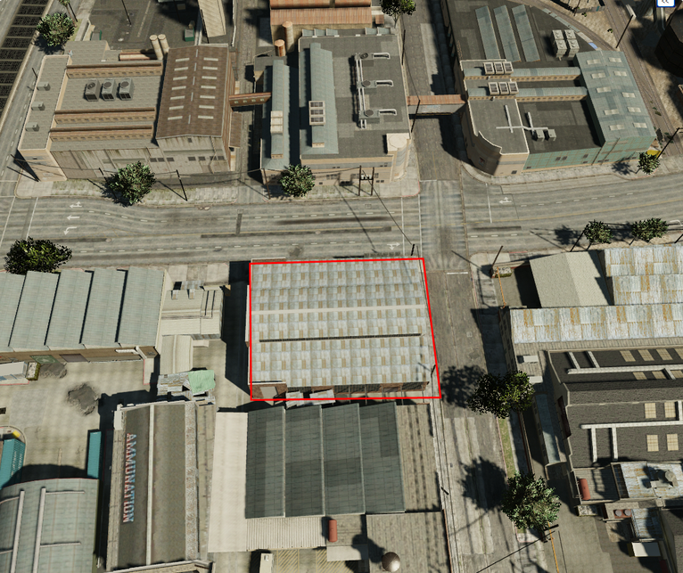<figcaption></figcaption></figure>

### 6. Cemitério de Aviões 

* Bandidos: Mín. de 2. | Máx. 3
* Políciais: Máximo de 4.
* Armamento: Somente Pistolas.
* Negociação: Não há.
* Refém: Não permitido.

Observações:

* Fugas são proibidas.
* Os assaltantes começam de dentro pra fora, e os policiais se encontram do outro lado da rua, indo de fora pra dentro.

<figure>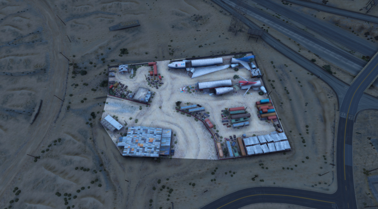<figcaption></figcaption></figure>

### 7. Cypress 

* Bandidos: Mín. de 5. | Máx. 7
* Políciais: 2 a mais que o número de bandidos.
* Armamento: Somente Pistolas.
* Negociação: Não há.
* Refém: Não permitido.

Observações:

* Somente Teti-Chão.
* Não é permitido pular muros no local.
* Proibido marcar drop da polícia
* Fuga não permitida.

<figure>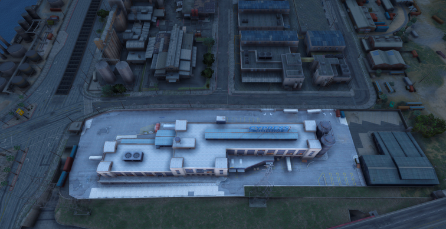<figcaption></figcaption></figure>

### 8. Estábulo 

* Bandidos: Mín. de 5. | Máx. 6
* Políciais: 2 a mais que o número de bandidos.
* Armamento: Somente Pistolas.
* Negociação: Não há.
* Refém: Não permitido.

Observações:

* Obrigatoriamente TetiChão
* Fugas não estão permitidas.
* Não é permitido marcar drop da polícia.

<figure>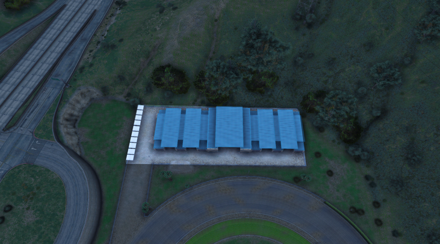<figcaption></figcaption></figure>

### 9. Festa Junina 

* Bandidos: Mín. de 6. | Máx. 8
* Policiais: 2 a mais que a quantidade de bandidos.
* Armamento: Somente Pistolas.
* Negociação: Não há.
* Refém: Não permitido.

Observações:

* Fugas são proibidas.

<figure>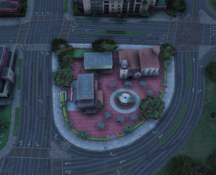<figcaption></figcaption></figure>

### 10. Banco Flecca Paleto 

* Bandidos: Mín. de 10 | Máx. 12
* Políciais: 3 a mais que o número de bandidos.
* Armamento: Somente Fuzil.
* Negociação: Obrigatória.
* Refém: Mín. 2 | Máx. 4
* Smokes: Máx. 4.

Observações:

* Fugas são proibidas.
* Mínimo de 2 reféns necessários para a fuga e máximo de 4 veículos para os bandidos. Somente 4 bandidos podem ficar de fora; Deve-se esperar a morte de 4 polícias depois do início da ação para rushar para fora. Não é permitido utilizar interiores exceto o do banco nesta ação. Heli somente com 2 atiradores e drop permitido apenas 1 vez.
* Fleeca Life Invader: Proibido usar o interior. Estacionamento/Piscina Máx. 2 bandidos;
* Fleeca do Shopping: Proibido usar metrô. Estacionamento/Piscina Máx. 2 bandidos;
* Fleeca Praça: Só poderá ser feito na fuga (Precisa-se de 2 reféns para negociar);
* Fleeca Praia: Totalmente Teti Chão + Heli sem atirador. (Podendo estar todos fora);
* Fleeca Rota 68: Totalmente Teti Chão + Heli sem atirador. (Podendo estar todos fora) Estacionamentos não são considerados como INTERIOR / PRÉDIO.

<figure><figcaption></figcaption></figure>

### 10.1 Perímetro Life Invader 

<figure>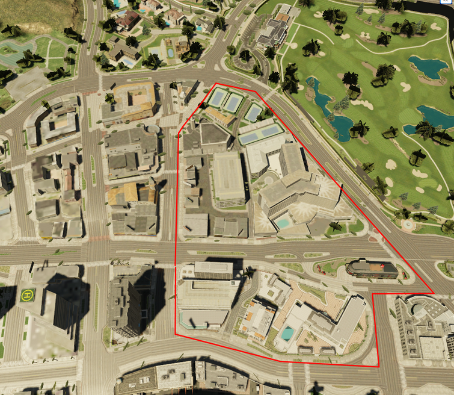<figcaption></figcaption></figure>

### 10.2 Perímetro Fleeca do Shopping 

<figure>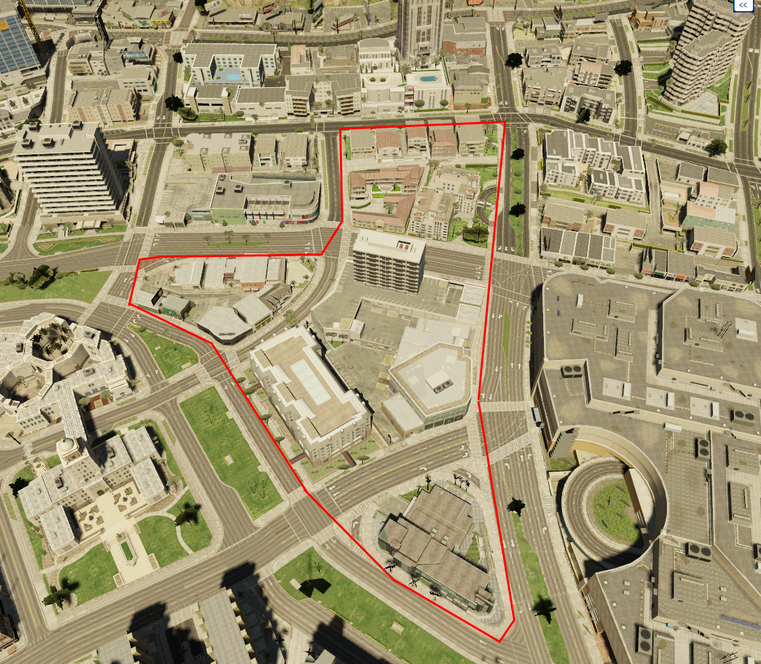<figcaption></figcaption></figure>

### 10.3 Fleeca Praia 

<figure>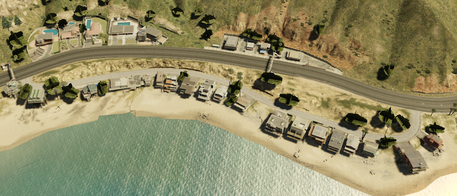<figcaption></figcaption></figure>

### 10.4 Fleeca Rota 68 

<figure>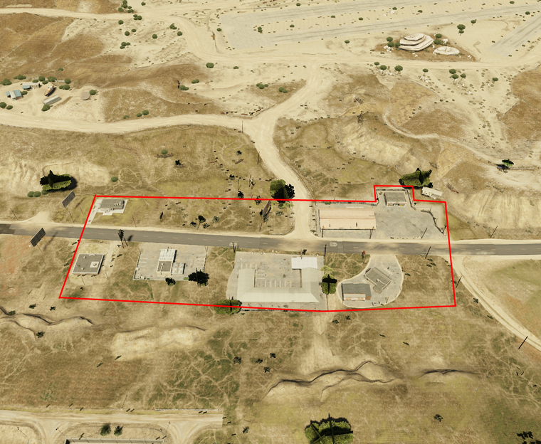<figcaption></figcaption></figure>

 
