# 🔫 Ações G-M

### 1. Galinheiro 

* Bandidos: Mín. de 10 | Máx. 12
* Políciais: 3 a mais que o número de bandidos.
* Armamento: Somente Submetralhadoras.
* Negociação: Não há.
* Refém: Não permitido.
* Smoke: Máx. 3.

Observações:

* Fugas são proibidas.
* Não é permitido ficar de fora.
* Após o inicío da ação, é permitido rushar para fora.

<figure>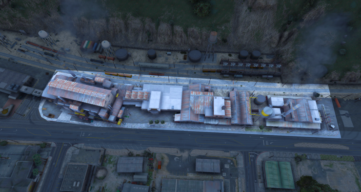<figcaption></figcaption></figure>

### 2. Golf 

* Bandidos: Mín. de 4 | Máx. 6
* Políciais: 2 a mais que o número de bandidos.
* Armamento: Somente Pistola.
* Negociação: Não há.
* Refém: Não permitido.

Observações:

* Fugas são proibidas.
* Obrigatório TetiChão.

<figure>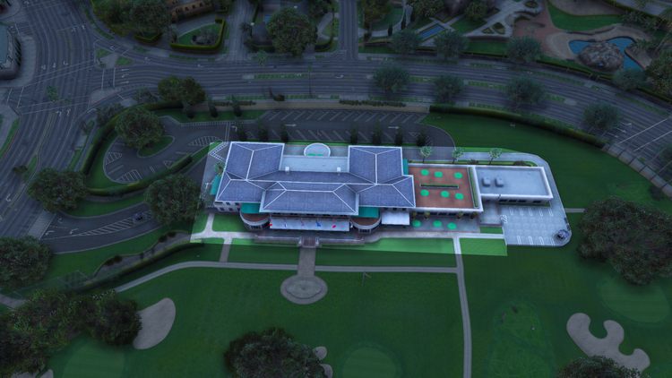<figcaption></figcaption></figure>

### 3. Hollywood 

* Bandidos: Mín. de 8 | Máx. 12
* Policiais: 3 a mais que o número de bandidos.
* Armamento: Submetralhadora ou Fuzil.
* Negociação: Obrigatória.
* Refém: Mín. de 2 | Máx. 5.
* Smoke: 3.

Observações:

* Permitido apenas 1 sniper de cada lado.
* Obrigatório TetiChão.
* Helicóptero: Proibido para ambos os lados.

<figure>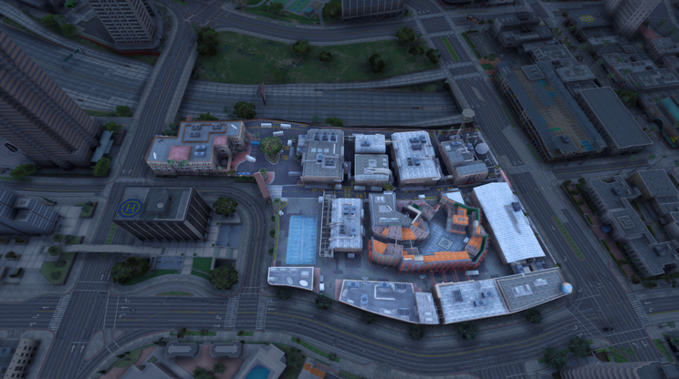<figcaption></figcaption></figure>

### 4. Hipermercado 

* Bandidos: Mín. de 2 | Máx. 4
* Policiais: 2 a mais que a quantidade de bandidos.
* Armamento: Somente pistola.
* Negociação: Não há.
* Refém: Não permitido.

<figure>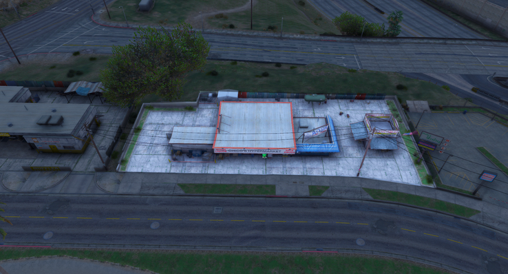<figcaption></figcaption></figure>

### 5. Iate 

* Bandidos: Mín. de 7 | Máx. 10
* Policiais: 3 a mais que o número de bandidos.
* Armamento: Somente pistola.
* Negociação: Obrigatória.
* Refém: Mín. de 1 | Máx. 3.
* Smoke: 3.

Observações:

* Obrigatório TetiChão.
* Proibido utilizar helicóptero.
* Proibido pular na água.

<figure>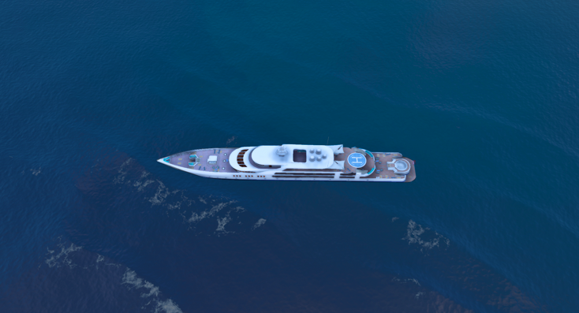<figcaption></figcaption></figure>

### 6. Joalheria 

* Bandidos: Mín. de 6 | Máx. 7
* Policiais: 2 a mais que o número de bandidos.
* Armamento: Somente submetralhadoras.
* Negociação: Obrigatória.
* Refém: Mín. de 2 | Máx. 4.
* Smoke: 3.

Observações:

* Deve-se esperar 5 minutos para rushar para fora.
* Máximo de 3 bandidos fora.
* Não é permitido usar o metrô ou interiores.
* Será utilizado um veículo blindado da polícia durante a ação, e para retirar o blindado serão necessários 2 reféns.
* Para retirar 1 (uma) smoke é necessário 2 (dois) reféns, a partir da segunda, cada smoke é equivalente a um refém.

<figure>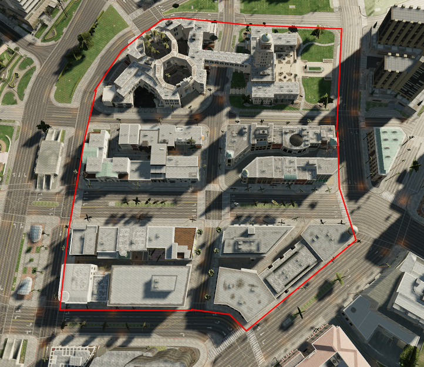<figcaption></figcaption></figure>

### 7. Jockey 

* Bandidos: Mín. de 2 | Máx. 4
* Policiais: 1 a mais que o número de bandidos.
* Armamento: Apenas Pistola.
* Negociação: Não há.
* Refém: Não Permitido.

Observações:

* Obrigatoriamente TetiChão

<figure>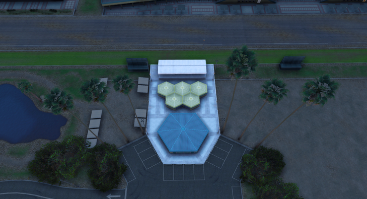<figcaption></figcaption></figure>

### 8. Lanchonete 

* Bandidos: Mín. de 2 | Máx. 4
* Policiais: 1 a mais que o número de bandidos.
* Armamento: Apenas Pistola.
* Negociação: Não há.
* Refém: Não Permitido.

Observações:

* Obrigatoriamente TetiChão

<figure>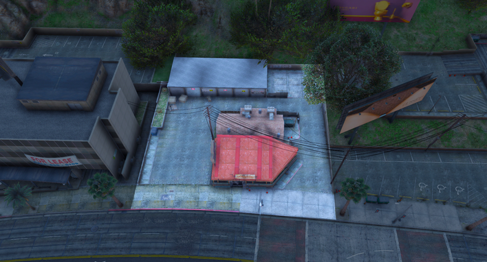<figcaption></figcaption></figure>

### 9. Lojinhas de Conveniência 

* Bandidos: Mín. de 3 | Máx. 4
* Policiais: 1 a mais que o número de bandidos.
* Armamento: Apenas Pistola.
* Negociação: Não há.
* Refém: Não Permitido.

Observações:

* Obrigatoriamente TetiChão
* Proibido usar interiores que não seja o da ação.,

<figure>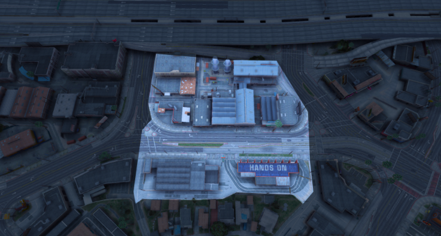<figcaption></figcaption></figure>

### 9.2 Lojinhas 

<figure>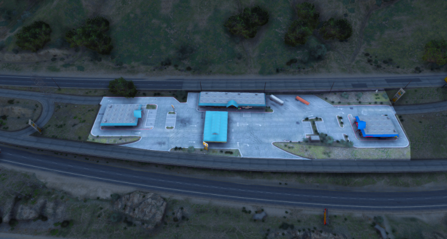<figcaption></figcaption></figure>

### 9.3 Lojinhas 

<figure>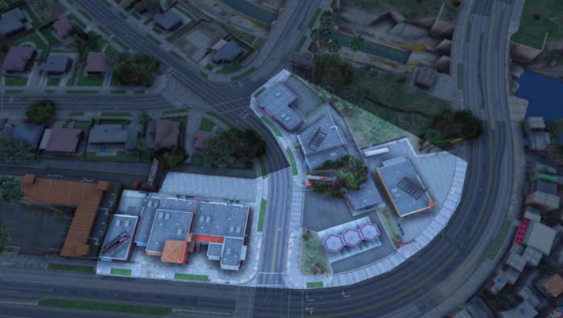<figcaption></figcaption></figure>

### 9.4 Lojinhas 

<figure>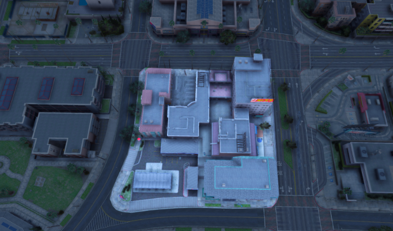<figcaption></figcaption></figure>

### 9.5 Lojinhas 

<figure>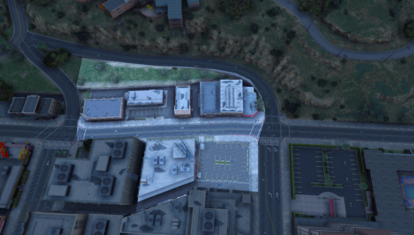<figcaption></figcaption></figure>

### 9.6 Lojinhas 

<figure>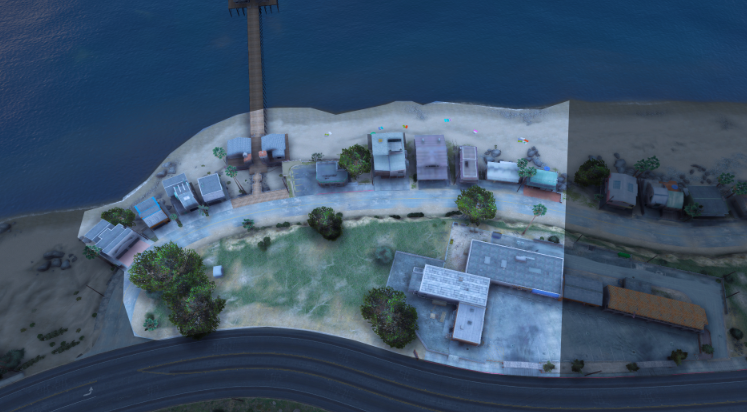<figcaption></figcaption></figure>

### 9.7 Lojinhas 

<figure>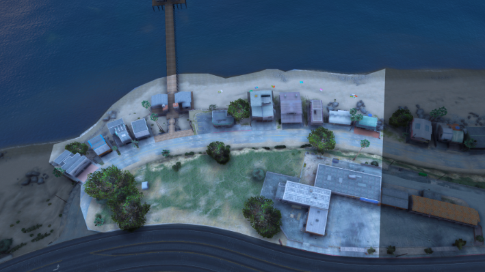<figcaption></figcaption></figure>

### 9.8 Lojinhas 

<figure>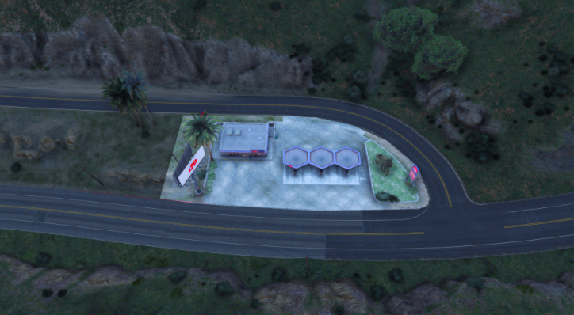<figcaption></figcaption></figure>

### 9.9 Lojinhas 

<figure>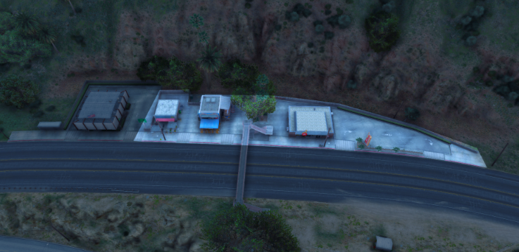<figcaption></figcaption></figure>

### 9.10 Lojinhas 

<figure>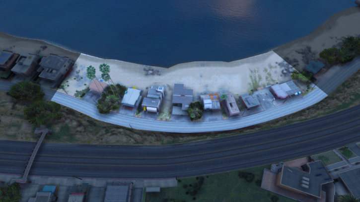<figcaption></figcaption></figure>

### 9.11 Lojinhas 

<figure>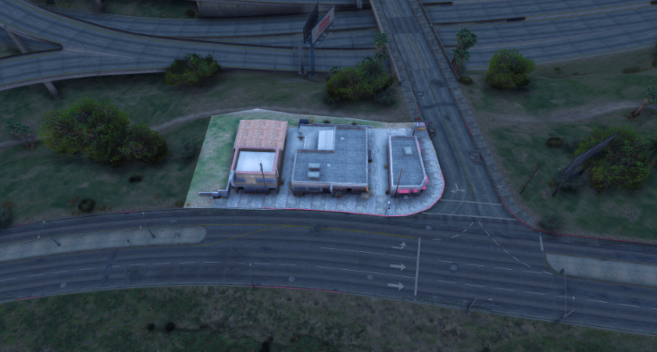<figcaption></figcaption></figure>

### 9.12 Lojinhas 

<figure>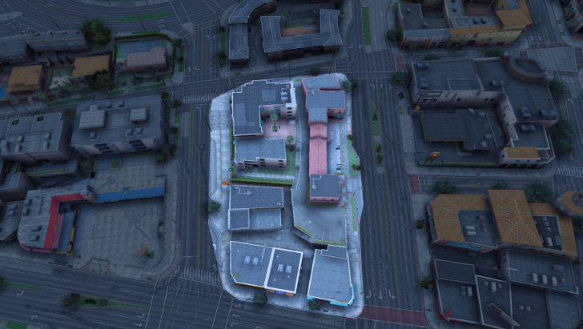<figcaption></figcaption></figure>

### 9.13 Lojinhas 

<figure>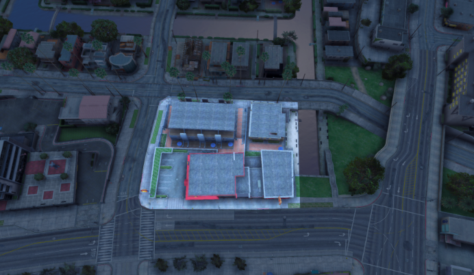<figcaption></figcaption></figure>

### 10. Mc Donald's 

* Bandidos: Mín. de 3 | Máx. 4
* Policiais: 1 a mais que o número de bandidos.
* Armamento: Apenas Pistola.
* Negociação: Não há.
* Refém: Não Permitido.

Observações:

* Obrigatoriamente TetiChão
* Fugas são proibidas.
* Não é permitido marcar drop da polícia.

<figure>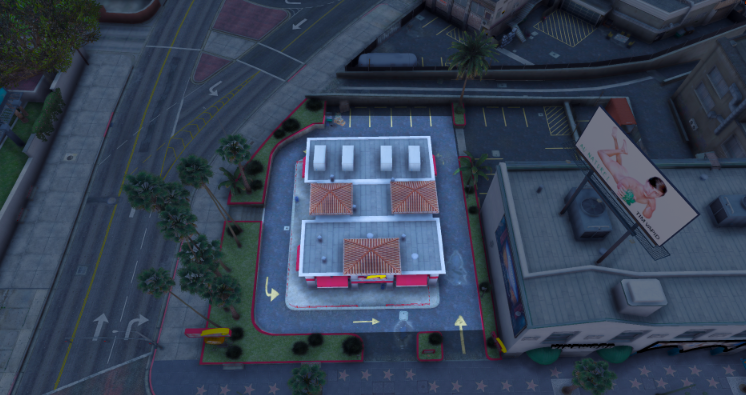<figcaption></figcaption></figure>

### 11. Mini Porto 

* Bandidos: Mín. de 6 | Máx. 8
* Policiais: 2 a mais que o número de bandidos.
* Armamento: Apenas Submetralhadora.
* Negociação: Não há.
* Refém: Não Permitido.

Observações:

* Obrigatoriamente TetiChão
* Fugas são proibidas.
* Não é permitido marcar drop da polícia.

<figure>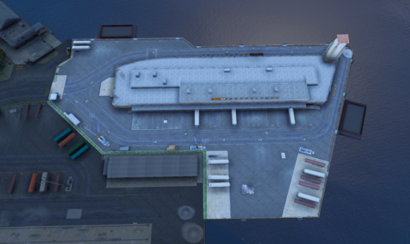<figcaption></figcaption></figure>

 
